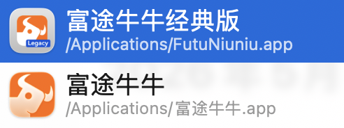
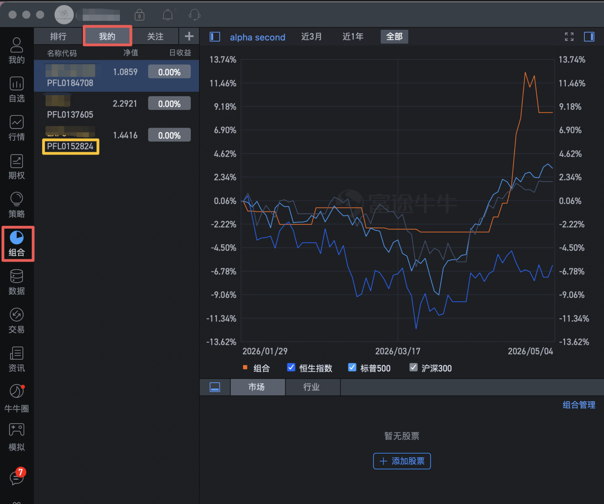

# Futufolio

通过模拟点击自动调仓富途牛牛的模拟组合（虚拟组合）。

程序利用 macOS Accessibility API 控制富途牛牛桌面端，模拟用户操作完成调仓，不涉及真实交易。

## 前置条件

1. 下载老版富途牛牛 Mac 客户端（非 App Store 版本）

   

2. 打开客户端后，进入模拟组合的调仓界面：

   

   **注意：程序运行前必须停留在此界面。**（后续版本会更灵活）

3. 首次运行会跳出授予终端 macOS 辅助功能权限（系统设置 → 隐私与安全性 → 辅助功能）

## 安装

```bash
uv sync --extra macos
```

## 使用方法

命令格式：

```bash
uv run futufolio <股票代码> [目标仓位百分比] --portfolio <组合编号>
```

组合编号以 `FPL` 开头，例如 `FPL0137605`。

**目前只支持一次调仓一只股票。运行脚本期间不要动键盘和鼠标（程序需要控制输入设备，持续 3 秒以内）。**

### 示例

```bash
# 将 MSFT 设为 100% 仓位
uv run futufolio MSFT --portfolio FPL0137605

# 将 MSFT 设为 50% 仓位
uv run futufolio MSFT 50 --portfolio FPL0137605

# 清仓 MSFT
uv run futufolio MSFT close --portfolio FPL0137605
uv run futufolio MSFT 0 --portfolio FPL0137605

# 试运行（不会真正确认）
uv run futufolio MSFT 50 --dry-run --portfolio FPL0137605
```

也可以通过环境变量设置默认组合编号，避免每次输入：

```bash
export FUTU_PORTFOLIO_CODE=FPL0137605
uv run futufolio MSFT 50
```

## Python API

```python
from futufolio import FutuPortfolioClient

client = FutuPortfolioClient()
client.set_position("MSFT", 50, portfolio_code="FPL0137605")
client.close_position("MSFT")
```

## 注意事项

- 这是 GUI 自动化工具，富途客户端 UI 更新可能导致程序失效
- 运行期间请勿移动鼠标或使用键盘
- 建议先用 `--dry-run` 验证流程，再正式执行
