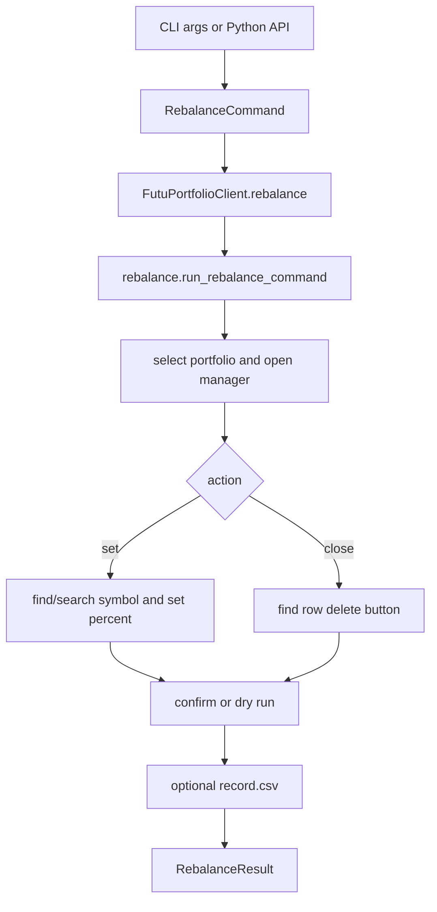

# Futu Portfolio Rebalance Design

## Design Principle

This project follows a small-interface, data-first style inspired by Peter Norvig:

1. Keep the public interface obvious.
2. Represent intent as data.
3. Keep command parsing, business workflow, and UI mechanics separate.
4. Optimize the hot path, but keep safety checks around fixed-position clicks.
5. Prefer boring modules over a framework.

## Goal

Automate a repeatable single-symbol portfolio rebalance operation in FutuNiuniu on macOS:

1. Open the Portfolio Manager window.
2. Optionally select a portfolio by code.
3. Search for a stock code when it is not already in the current portfolio rows.
4. Select the exact search result.
5. Set the target position percentage.
6. Confirm the change.
7. Support close/removal by clicking the row's trash icon.
8. Optionally append a rebalance record only when requested.

## Public Interfaces

### CLI

```bash
uv run futu-portfolio MSFT 100
uv run futu-portfolio MSFT close
uv run futu-portfolio MSFT 50 --portfolio PFL0137605
```

Compatibility entrypoints:

```bash
python3 futu_portfolio.py MSFT 100
python3 futu_utils/futu_portfolio.py MSFT 100
python3 -m futu_utils MSFT 100
```

### Python API

```python
from futu_utils import FutuPortfolioClient

client = FutuPortfolioClient()
client.set_position("MSFT", 50)
client.close_position("MSFT")
```

Stable command-object interface:

```python
from futu_utils import FutuPortfolioClient, RebalanceAction, RebalanceCommand

command = RebalanceCommand(symbol="MSFT", action=RebalanceAction.SET, percent="50")
result = FutuPortfolioClient().rebalance(command)
```

`RebalanceCommand` is the boundary object. Lower-level modules may change, but external callers should not need to change.

## Module Boundaries

| Layer | Module | Responsibility |
| --- | --- | --- |
| Public API | `api.py`, `models.py` | Stable objects and client methods for external scripts |
| CLI | `cli.py`, `__main__.py`, entrypoint scripts | Parse arguments and print `RebalanceResult` lines |
| Use case | `rebalance.py` | Execute set/remove workflows and return results |
| Futu app | `futu_app.py`, `portfolio_selector.py` | Activate app, select portfolio, open manager |
| UI selectors | `manager_ui.py` | Locate manager controls and rows |
| AX runtime | `ax_utils.py`, `pyobjc_runtime.py` | Accessibility traversal, clicking, typing, permission checks |
| Persistence | `recorder.py` | Optional CSV append only |

## Command Flow



## Supported Actions

| Action | Example | Behavior |
| --- | --- | --- |
| Build/default position | `uv run futu-portfolio MSFT` | Set `MSFT` to `100%` |
| Set custom position | `uv run futu-portfolio MSFT 50` | Set `MSFT` to `50%` |
| Close/remove position | `uv run futu-portfolio MSFT close` | Click row trash icon, then confirm |
| Close/remove alias | `uv run futu-portfolio MSFT 0` | Same as `close`; does not type `0` into the position box |
| Dry run | `uv run futu-portfolio MSFT --dry-run` | Fill/select but do not click final confirm |
| Optional record | `uv run futu-portfolio MSFT 100 --record` | Confirm the UI operation and append `record.csv` |

## Rebalance Record

Confirmed operations are not recorded by default. When recording is requested, the script appends a row to:

```bash
futu_utils/record.csv
```

The file uses this column format:

```csv
日期,时间,股票名称,代码,变化前持仓,变化后持仓,成交价,说明
```

Record behavior:

- The file is created next to `recorder.py` if it does not exist.
- `成交价` is left blank because the UI automation flow does not always expose a reliable execution price.
- `--dry-run` never writes a record because it does not click final confirm.
- `--no-record` is accepted for compatibility, but no-record is already the default.

## Hot-Path Performance Rules

The fast path is intentionally narrow:

- Reuse the existing row when the symbol is already in the right-side table.
- Scan the right pane for close/remove instead of scanning the full Accessibility tree.
- Use direct `AXValue` text setting first, clipboard paste only as fallback.
- Click fixed-position search result / percent field / confirm points only after nearby safety checks.
- Preserve elapsed-time output for benchmarking.

See `performance.md` for measured local results and benchmark commands.

## Safety and Limitations

- This controls the FutuNiuniu desktop UI through macOS Accessibility.
- It is not a trading API and does not submit brokerage orders directly.
- UI layout changes in FutuNiuniu can break selectors.
- Confirmation checks verify that the manager window closes, not backend portfolio state.
- The user should avoid moving the mouse during execution.
